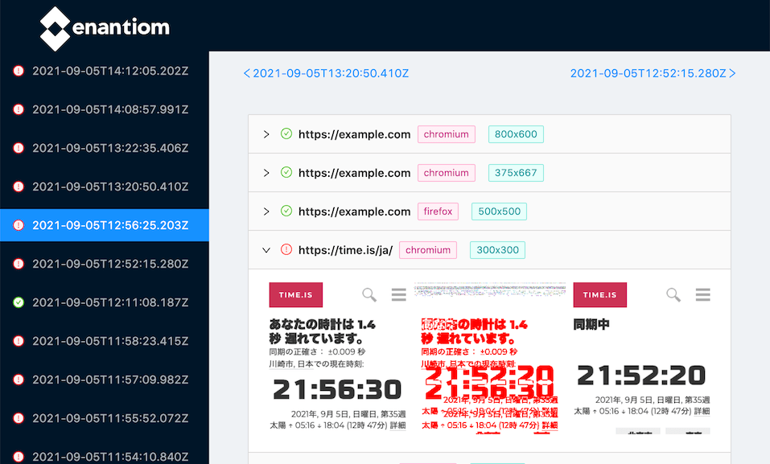

# [](https://github.com/airtoxin/enantiom)

[](https://badge.fury.io/js/enantiom)

[](https://opensource.org/licenses/MIT)

All-in-one web page screenshot testing tool.



## ✨ Features

- Take screenshot and compare with previous one
- Create static HTML report
- Change browser type / screen size
- Browser scripting

## 📦 Usage

Install the cli via **NPM**:

```
npm i -g enantiom
```

Install the cli via **Yarn**:

```
yarn global add enantiom
```

Create `enantiom.config.json`.

```json
{
  "artifact_path": "./dist",
  "screenshots": [
    "https://example.com",
    "https://time.is"
  ]
}
```

Then, run enantiom cli with config option.

```shell
$ enantiom --config enantiom.config.json
```

One more time, run same command to calculate pixel diff from previous result. 

```shell
$ enantiom --config enantiom.config.json
```

Static result report output to `dist` directory.  
Open it!

```shell
$ npx serve dist
```

## ⚙ Config

- [enantiom CLI options](./docs/CLI_OPTIONS.md)
- [enantiom.config.json](./docs/CONFIG_JSON.md)

examples are exists in [example](./example) directory.

## Development

Setup: just run `yarn`

### Tool development

```shell
$ yarn build
$ yarn link
$ enantiom --config example/enantiom.config.json --no-html
```

### React console development

```shell
$ yarn dev --config example/enantiom.config.json
$ yarn site:dev
```

## Feature TODOs

- Debug mode
- Non-top-level artifact_path
- Reuse browser object option
