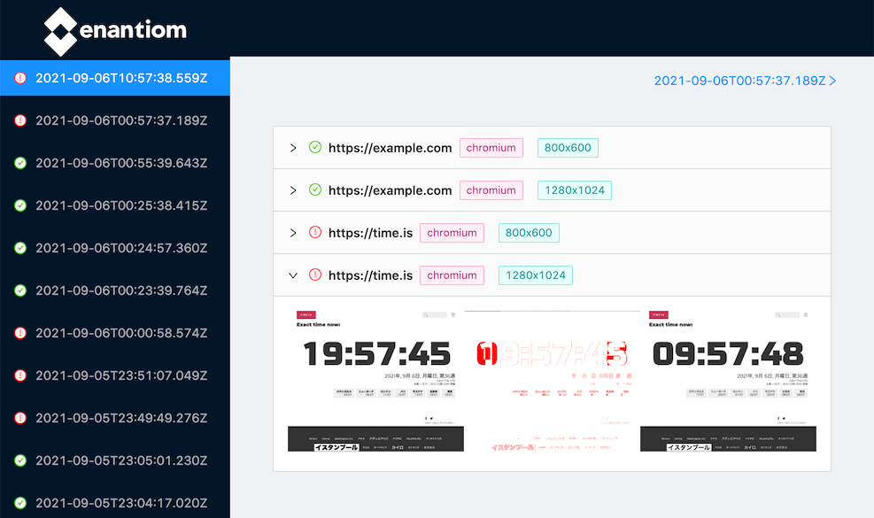

All-in-one web page screenshot testing tool.



## Config

[example/enantiom.config.json](./example/enantiom.config.json)

```json
{
  "artifact_path": "path to artifact directory (absolute or relative from pwd)",
  "screenshots": ["list of screenshot url"]
}
```

## Development

Setup: just run `yarn`

### Tool development

```shell
$ yarn build
$ yarn link
$ enantiom --config example/enantiom.config.json
$ npx serve dist
```

### React console development

```shell
$ yarn dev --config example/enantiom.config.json
$ yarn site:dev
```
